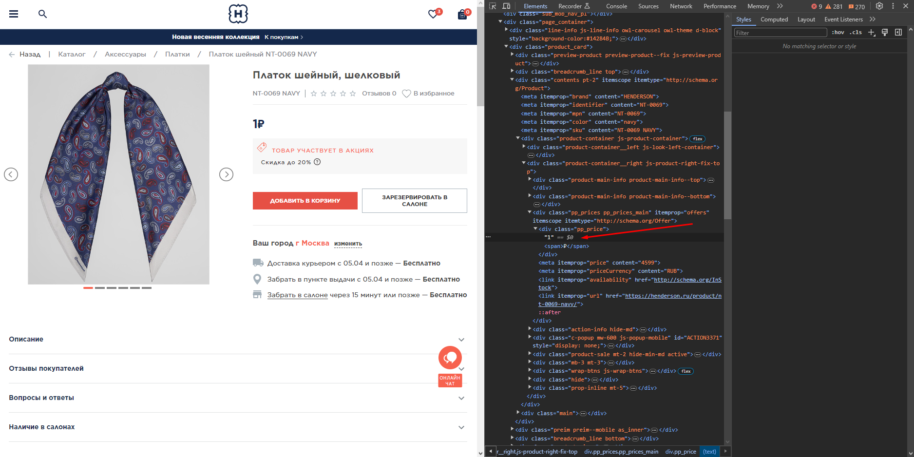
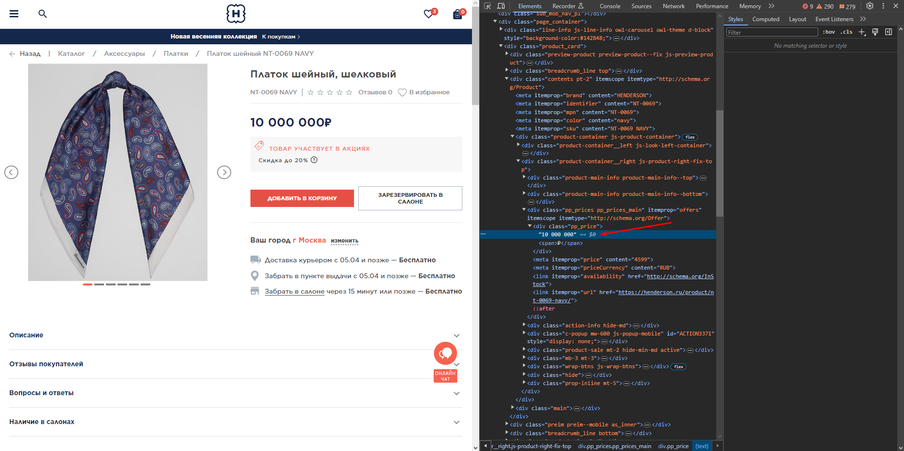
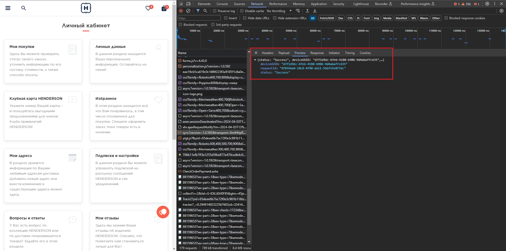

# Курсовой проект к модулю «Ручное тестирование веб-приложений»

## Задание 1

Написать чеклист для функциональной проверки личного кабинета зарегистрированного авторизованного пользователя, включая функционал разделов, на сайте henderson.

[Решение](https://docs.google.com/spreadsheets/d/1nzPqr1Ay02osJST8MzwPssIM8gbdmeXM/edit?usp=sharing&ouid=103143018510149849983&rtpof=true&sd=true)

## Задание 2

2.1. Необходимо написать набор тест-кейсов на проверку функционала восстановления пароля. Ваша задача — написать минимум 15 тест-кейсов, которые должны покрывать всё, что описано в требованиях.

[Решение](https://docs.google.com/spreadsheets/d/1vV50rLgfMOtys5PPqY_TjAmY8EBR_qzc/edit?usp=sharing&ouid=103143018510149849983&rtpof=true&sd=true)

2.2.*  Напишите свои вопросы по этим требованиям. Они могут касаться не описанных, но важных сценариев, граничных значений и подобных проблем.

Решение

Пользовательский сценарий по процессу восстановления пароля на сайте henderson.ru

Восстановление пароля личного кабинета на сайте возможно через авторизацию в личном кабинете https://henderson.ru/hlogin/

Пользователь на главном экране нажимает кнопку “Войти”.
Система отображает радио кнопки Войти “по email” или “по номеру телефона”, а также кнопку “Забыли пароль?”.
Пользователь нажимает кнопку “Забыли пароль?”, система отображает модальное окно с вариантами по способам связи восстановления пароля- радио кнопки “по email” или “по телефону”.

* Пользователь нажимает радиокнопку “по телефону”, система отображает поле для ввода номера телефона. 
* Пользователь вводит номер телефона (8-888-888-88-88) нажимает кнопку “Отправить”. 
  > Как система обрабатывает ввод номера в формате +7? Как реагирует система на попытку восстановить пароль с использованием ранее не зарегистрированного номера телефона?
* Система отображает поле “Проверочный код”.
* Система отправляет в смс или в вайбер код. 
  > Какой срок действия проверочного кода? Как реагирует система, если ввести проверочный код после истечения срока действия?
* Пользователь вводит 6-ти значный код. Нажимает кнопку “Отправить”. Система отображает страницу личного кабинета. На данной странице пользователь устанавливает новый пароль.
    > Как реагирует система, если пользователь введет меньше 6 символов?
* Для повторной отправки кода пользователю необходимо нажать кнопку “Код не пришел, повторить отправку”. 
  > Через сколько возможна отправка нового кода? Как реагирует система на попытку ввести неверный код? Есть ли какое-то ограничение на количество повторных отправок кода?

* Пользователь нажимает радиокнопку “по email”, система отображает поле для ввода email.
* Пользователь вводит email, система проводит валидацию, пользователь нажимает кнопку “Отправить”. 
  > Как реагирует система на попытку восстановить пароль с использованием ранее не зарегистрированного email?
* Система отображает сообщение: “На Ваш адрес мы направили письмо со ссылкой.
Перейдите по ней, чтобы подтвердить корректность адреса.”. Через несколько секунд система отображает кнопку “Письмо не пришло, повторить отправку”. 
  > Какой срок действия ссылки? Как реагирует система, если перейти по ссылке после истечения срока действия? Есть ли какое-то ограничение на количество повторных отправок письма?
* Система отправляет на почту письмо для перехода в личный кабинет. 

> Вопросы к требованиям выделены в тексте

[Решение](attachments/requirements.md)

## Задание 3

 На основе скриншота* создайте не менее трёх баг-репортов.

Скриншот*

 [Решение](https://docs.google.com/spreadsheets/d/1VgZKZi48X2ihkAL4SVgZMckXC4jI6Dj0/edit?usp=sharing&ouid=103143018510149849983&rtpof=true&sd=true)

 ## Задание 4

Вы тестируете страницу карточки товара. Из ТЗ вы знаете, что товар может стоить от 1 рубля до 10 000 000 рублей. К сожалению, на сайте сейчас товаров с такой ценой нет, а разработчик бэкенда в отпуске, поэтому вам нужно протестировать вёрстку страницы карточки товара с максимальной и минимальной ценой самостоятельно.
Ваша задача — самостоятельно определить, как проще это сделать, и предоставить решение в виде скриншотов страницы карточки товара с минимальной и максимальной ценой. Важно, чтобы было видно, с помощью чего вы изменили эту цену.

Решение

## Задание 5

Бэкенд-разработчик говорит, что мы отправляем данные с сайта в неправильном формате, и просит вас помочь найти нужный запрос.

Известно, что проблема в данных, которые уходят в POST запросе по адресу, который начинается с https://api.mindbox.ru/. Происходит это, скорее всего, при работе с личными данными пользователя, например, авторизацией, личным кабинетом, просмотром корзины.

Ваша задача — изучить ответы и запросы при работе с сайтом, найти запрос, в котором есть нужные параметры, найти, как же выглядят параметры deviceUUID, requestID и status, и приложить скриншот искомого превью в таблицу с решениями.

Решение

